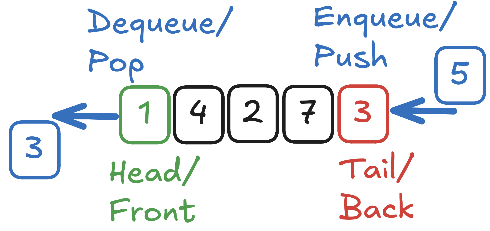

This is the first post in my [Daily DSA series](./DailyDSAIntro.md).

# The Queue

The queue is one of the most basic data structures. As one could guess from the
name it's like a queue. You enqueue some elements at the end and then dequeue
them at the beginning.

It is what's called FIFO (First In First Out). That means that the first element
we put into it is the first which we get out again. Which makes sense with a
queue. If you are the last to arrive at the checkout in the supermarket you're
also the last one who gets to pay.

# Anatomy of a Queue



A queue can consist of elements of any type. Here we just have simple integers
as keys. The first element in the queue (the next one to be dequeued) is
generally called _head_ or _front_. The last one _tail_ or _back_.

## Operations

The two most important operations for a queue are `enqueue` and `dequeue`.
Enqueue adds a new element to the back of the queue and dequeue removes the
first element of the queue and returns it. Sometimes (at least I do so) they're
also called `push` and `pop`. [^1]

Other useful functions a queue could provide are `is_empty` (obvious) and `peek`
(look at first element without removing it.

Some useful attributes some implementations provide is a `size` (how many
elements there currently are) and `capacity` (how many elements there at most
can be). If you don't think that the user can do it himself, you can with these
provide another helper function `is_full`.

# Analysis

_I promise for some later stuff this will be interesting._

The analysis for this is really straightforward. Space is $O(n)$, all operations
should be $O(1)$ (if you didn't either do a really weird implementation or doing
weird operations like `search`).

# Implementation

A simple implementation of a queue can be done using a doubly linked list. The
normal way to do this in Rust (and also a quite efficient and more cache
friendly way) is to use the `std::collections::VecDeque`. This is a double ended
queue [^2]. So it has similar properties as the queue described above, put allow
`push` and `pop` from both ends. So if you want exactly what was described
above, just use `push_back` and `pop_front`. But you can also use both ends of
the queue if it fits your use case.

```rust
use std::collections::VecDeque;

let mut deq = VecDeque::from([-1, 0, 1]);

let first_element = deq.pop_front(); // Some(-1)

deq.push_back();
```

For more (mostly) useful methods see
[the std docs](https://doc.rust-lang.org/std/).

## Manual Implementation with Array

For educational purposes we'll implement a queue ourselves. It uses an array
(ewww, lifetimes needed) to implement a ring buffer which is used to implement
the queue. It therefore has a fixed capacity and insert can fail.

I wouldn't recommend actually using this and the only thing I can guarantee
about it is, that it's not written by an LLM.

```rust
pub struct Queue<'a> {
    buffer: &'a mut [i32],
    len: usize,
    head: usize,
    tail: usize,
}

impl<'a> Queue<'a> {
    /// Create a new queue using an existing buffer
    pub fn new(buffer: &'a mut [i32]) -> Self {
        Self {
            buffer,
            head: 0,
            tail: 0,
            len: 0,
        }
    }

    /// Enqueue an item
    /// Returns true on succes, false on error
    pub fn enqueue(&mut self, item: i32) -> bool {
        let capacity = self.buffer.len();
        if self.len == capacity {
            return false;
        }
        self.buffer[self.tail] = item;
        // Wrap around
        self.tail = (self.tail + 1) % capacity;
        self.len += 1;
        true
    }

    pub fn dequeue(&mut self) -> Option<i32> {
        if self.len == 0 {
            return None;
        }
        let item = self.buffer[self.head];
        self.head = (self.head + 1) % self.buffer.len();
        self.len -= 1;
        Some(item)
    }
}
```

You could improve this by

1. Making it for a generic type `T`
2. Using a `Vec<T>` for storage to allow dynamic capacity (if that's wanted)

# Use Cases

Queues have some real world applications and also a lot of them in other
algorithms (of which I'll hopefully cover plenty here later).

One of the most obvious examples is some form of scheduling. That can be e.g. a
server having to do multiple tasks and then there are workers which can take
tasks from the queue and work on them. This can trivially be implemented with a
queue. It also works quite well with multiple workers and schedulers with a
simple lock while pushing/popping.

## Non-Use Cases

- Things which need deletion/insertion from middle
  - These take $O(n)$ time which isn't efficient
  - Examples could be if we have jobs, but some have a higher priority, so we
    aren't processing strictly by insertion order
- We need to search for specific elements
  - Again takes $O(n)$ time, when faster times would be possible with more
    efficient data structures.

# Example Problems

## Throwing Cards Away

**Problem:** You have a deck of $n$ cards, $c_1, ..., c_n$. In each step you
throw away the top card and put next card to the bottom until you just have a
single card left. Which card will you have in your hand at the end?

While there might be a formula or something to calculate this in constant time
(seems like an interesting problem to think about) we can solve this in $O(n)$
by simply simulating this with a queue.

```rust
let mut q = Queue::new(cards);
while q.len() > 1 {
    queue.dequeue();
    queue.enqueue(queue.dequeue().unwrap());
}
let answer = queue.dequeue().unwrap();
```

# Variations

These are some variations of the basic data structure. They're here if you want
to research more for yourself on the topic. I might also at some point write a
post about them.

- Double-ended Queue (explained here)
- Priority Queue
- Monotonic Queue

# References

- [Geeks for Geeks](https://www.geeksforgeeks.org/dsa/queue-data-structure/)

[^1]:
    Though thinking about it, in general that terminology is mostly just used
    for stacks.

[^2]:
    For those interested: Implemented with a growable (sth like a `Vec`) ring
    buffer.
